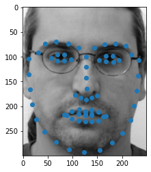
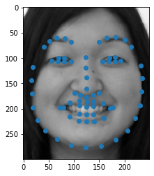
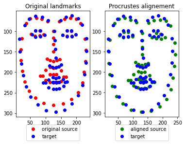
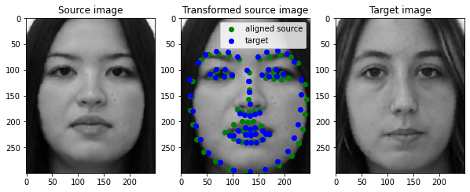
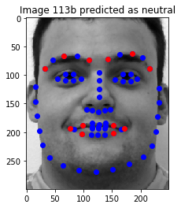

<h1 style="text-align:center">LandMark Based Face Registration & Emotion Recognition</h1>


The goal of this notebook is to implement the algorithms  for landmarks based registration.
Align face images with a target landmark. and predict emotion ( Neutral , Happy ) based on these landmarks.

## Dataset 
We will use the [FEI dataset](https://fei.edu.br/~cet/facedatabase.html) which is composed of several facial images annotated with 68 landmarks (already estimated and placed). Below, you will find a picture with an example. People express two emotions, either neutral or happy.

The Dataset contains: 
- List of images
- Position of Landmark
- Class label : 
    - 0 : Neutral 
    - 1 : Happy


|Neutral Face Image Sample          |  Happy Face Image Sample |
:-------------------------:|:-------------------------:
  |    |
you can download the dataset from google drive  or use the local files : 

```python 
from google_drive_downloader import GoogleDriveDownloader as gdd
gdd.download_file_from_google_drive(file_id='15vsAdMepHzdoZ3iqNS3kpI3KGW7D0vRs',
dest_path='./data/Data_FEI.npz')
gdd.download_file_from_google_drive(file_id='1ywQbf23-JoPklWCcH_mi5Nuw5BQskxvB',
dest_path='./data/facial_landmarks_68markup.jpg')
```

## Face Image Registration
The idea of the algorithm is to find the best transformation that align source Landmark to a target landmark. Then use that transformation to align face image to a target face image. 
- Landmark registration: 


- Face image LandMared-based registration: 


## Emotion Recognition 

Using the landmark we do feature engineering to generate features to train our models on. 
For that we used  the paired Euclidian distances between the aligned landmarks of every subject  and the landmark of the average subject. 


## Results 

- We achieved a cross-validation score of 96.25 % +/-(0.58%)
- We applied PCA to extract a set of landmaks containing the most informations about the emotion. It is used for dimensionality reduction by projecting each data point onto only the first few principal components to obtain lower-dimensional data while preserving as much of the data's variation as possible




## TO DO 
- Use Deep learning to do image registration ,e.g: VoxelMorph. 
